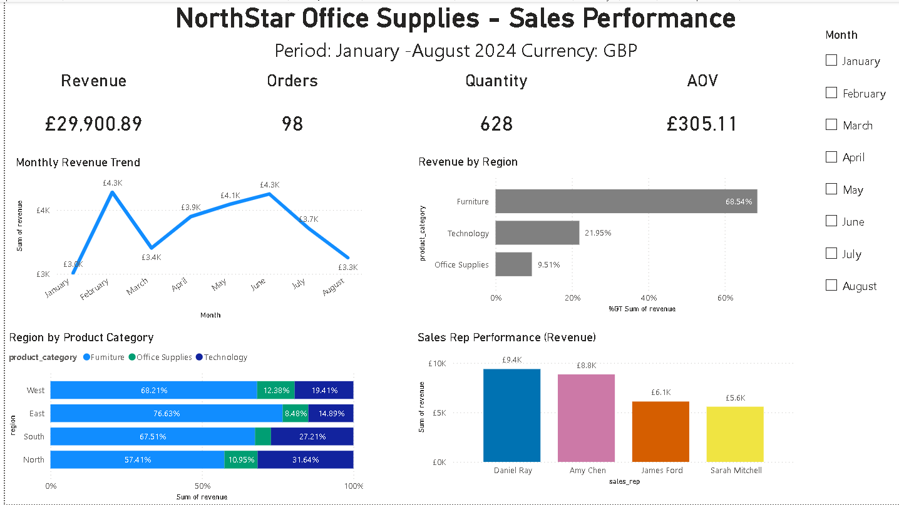
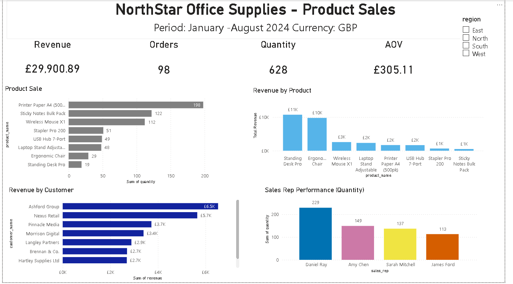
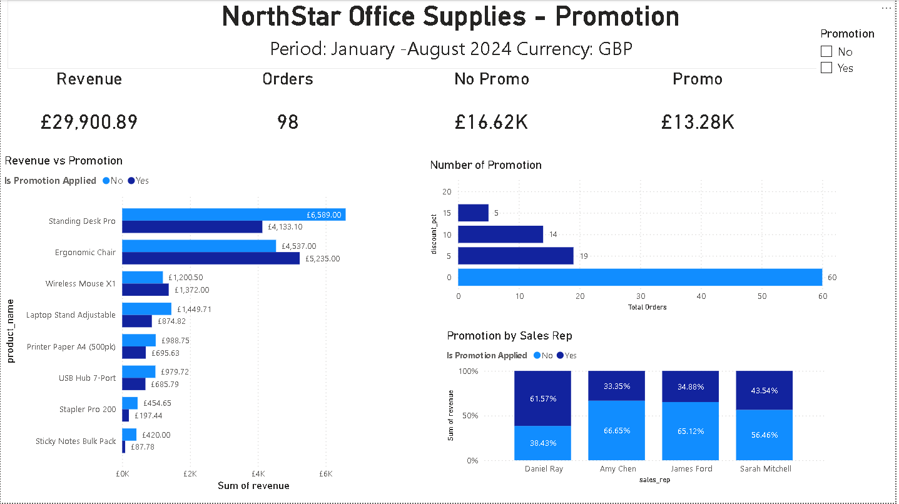

# BI_Sales_Data_Performance
BI Sales Data Performance

Task: You have been brought in to support NorthStar Office Supplies, a mid-sized B2B office products distributor operating across four UK regions. The business has been collecting sales transaction data in a shared spreadsheet for the past year, but no one has ever cleaned it, structured it, or turned it into anything useful. What is the performance across our regions and product categories. Want to see revenue trends over time, which products and regions are driving growth, and which sales reps are performing well.

[Data checks](datachecks.ipynb) was completed in a Jupyter Notebook using Python pandas for data ingestion, cleaning, and revenue calculation and Markdown cells for comments and explanations.

[Raw Data](sales_data_raw.csv) turned into [Clean Data](sales_data_cleaned.csv)

Assumptions made:
- Duplicate records to remove were the two listed in the task issue log (order_id 1016 and 1076), keeping first occurrence.
- Canonical customer name for customer_id C0091 is "Greenfield Corp" because it is the valid named value appearing later in the dataset.
- Revenue formula used exactly as specified: quantity * unit_price * (1 - discount_pct / 100), rounded to 2 decimals.

[Power BI dashboard](BI_Sale_Performance.pbix)

